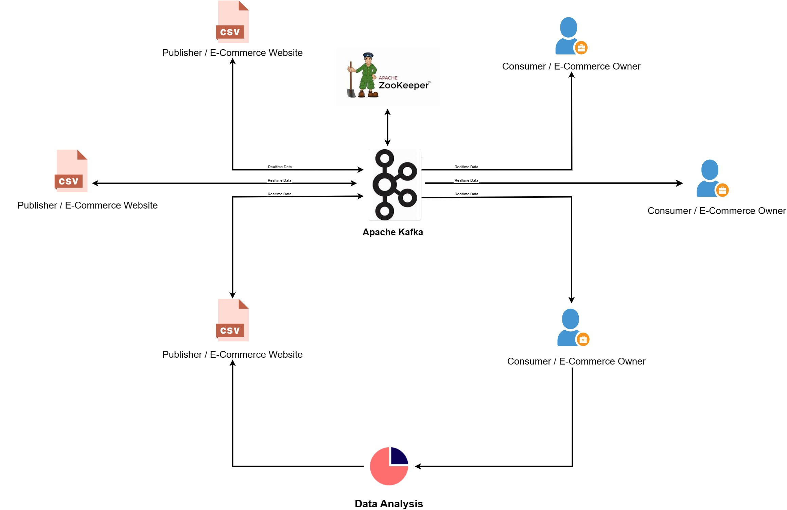

# Data Science and Big Data Project

## Real Time Prediction of Purchasing sum based on previous Sales data.

### Introduction

In this project, we created an End-To-End Data Science and Big Data Project on Real-Time Sales Data using Kafka.

We are going to use different technologies such as Python, Amazon Web Services (AWS) and Apache Kafka.

### Architecture

## Technology Used

- Programming Language - Python
- Amazon Web Service (AWS)
- Apache Kafka

## Dataset Used

Here is the dataset used in this project - https://www.kaggle.com/code/harshjain123/black-friday-sales-data-analysis/notebook

## Demo Video

Here is the demo for this project - https://drive.google.com/file/d/1KsTe0X7jBH-gFHlbSiq9CePxttSwV0Ty/view

## Commands

#### Refer to [Command.md](command.md) for project set up.
